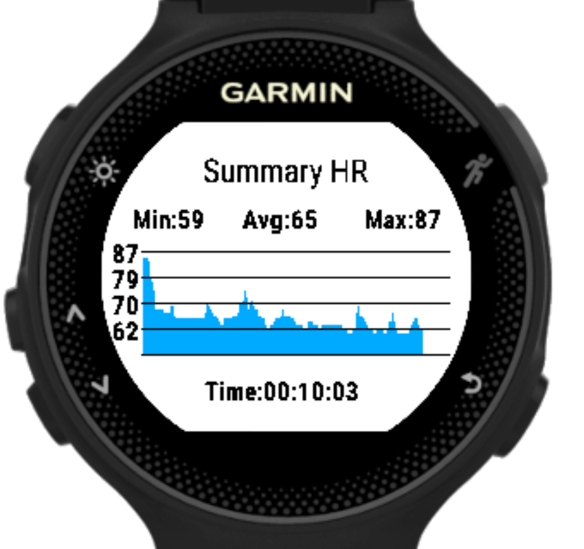

# Meditate

A Garmin Connect IQ meditation app (originally from vtrifonov) that tracks as an activity the heart rate and provides vibration alert for Garmin Forerunner 235.
## Features

- Meditation sessions from 5min to 30min with longer vibration in the end and small blip every 5min

- Summary stats at the end of the session
    - Tracks the overall min, avg and max HR
    - Show heart rate chart

- Ability to save the session as a Connect IQ activity

- Custom activity names can be set

Set Activity Name as "Location & Device Activity Name" in Garmin Connect Settings (https://connect.garmin.com/modern/settings) for activity name generated to be saved correctly.

Set custom activity name using Garmin Connect or Garmin Express, refer to guide https://support.garmin.com/en-US/?faq=SPo0TFvhQO04O36Y5TYRh5 for help.

## Supported Devices
- Garmin Forerunner 235

