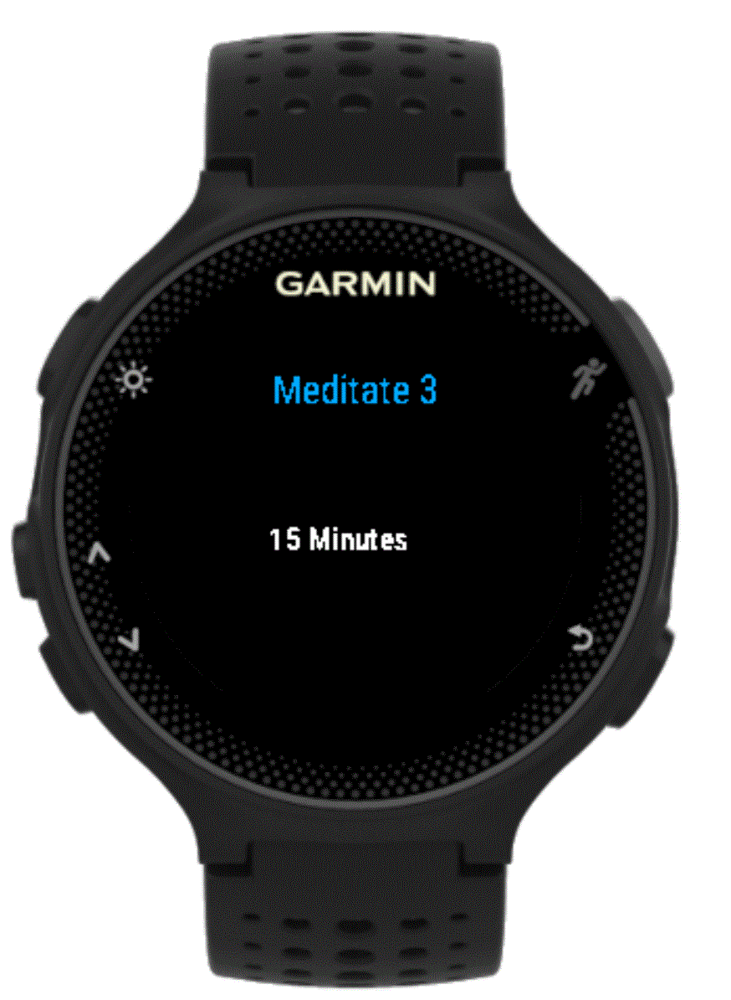
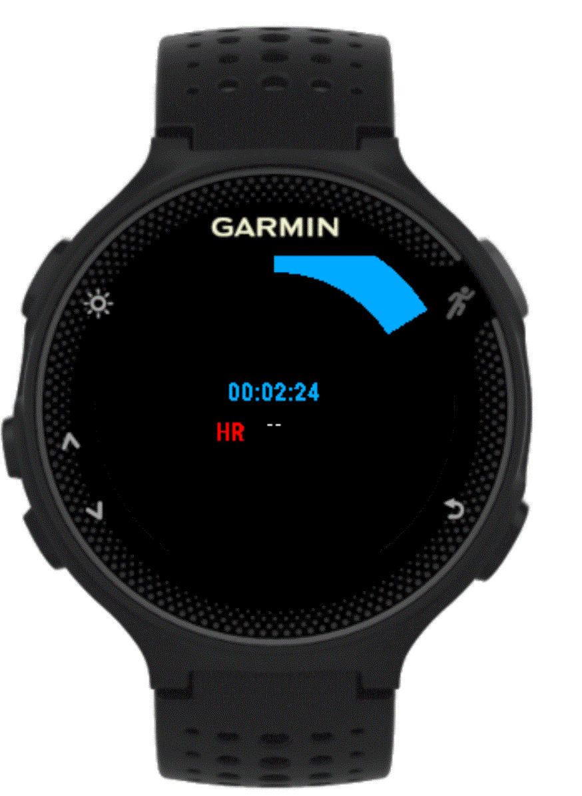

# Meditate

A Garmin Connect IQ meditation app (originally from vtrifonov) that tracks as an activity the heart rate and provides vibration alert for Garmin Forerunner 235.
## Features

- ability to save the session as a Connect IQ activity
 
- summary stats at the end of the session
    - tracks the overall min, avg and max HR

## Supported Devices
- Garmin Forerunner 235

